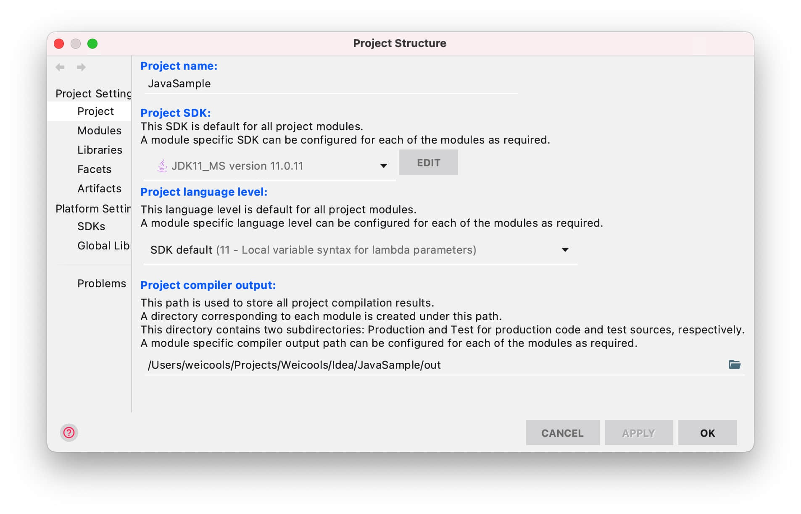
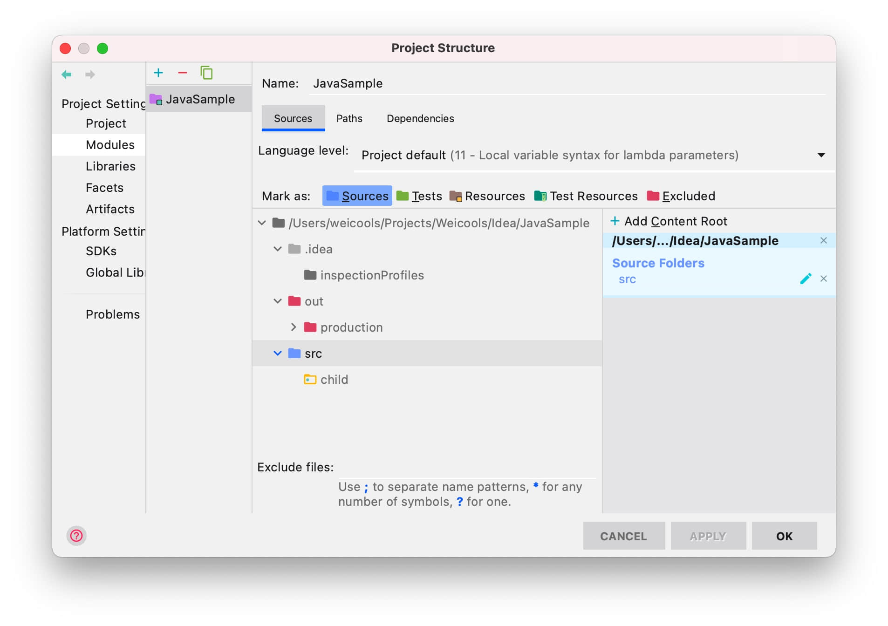
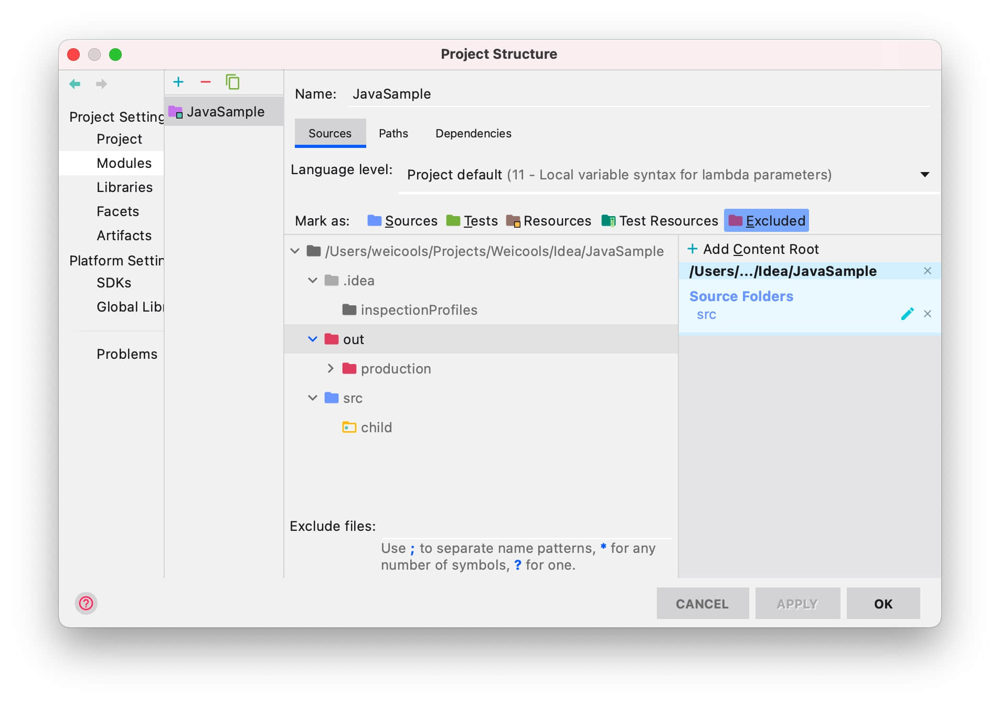
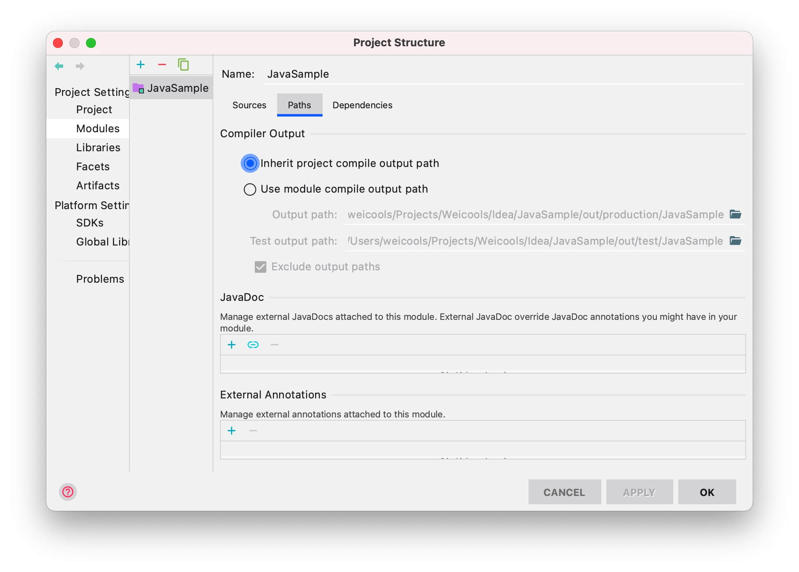
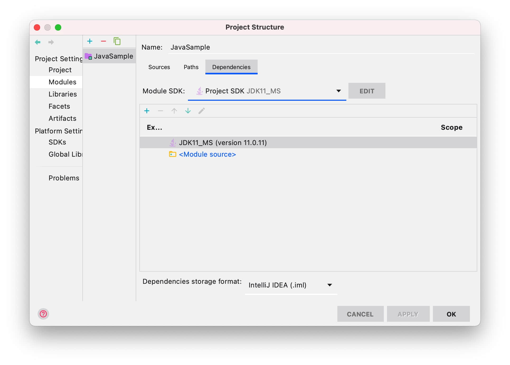

# 运行相关问题

## IDEA 错误: 找不到或无法加载主类

keep `out`, `src`, `.gitignore`, `*.md`, delete others file, and restart project

use `command + ;` open `Project Structure`
    - set Project `Name`, `JDK`, `Language level`
    - set Module: import `HelloAlgorithms`, check sources/sources, paths, dependencies

check from JavaSample Project Structure

